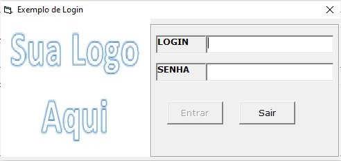
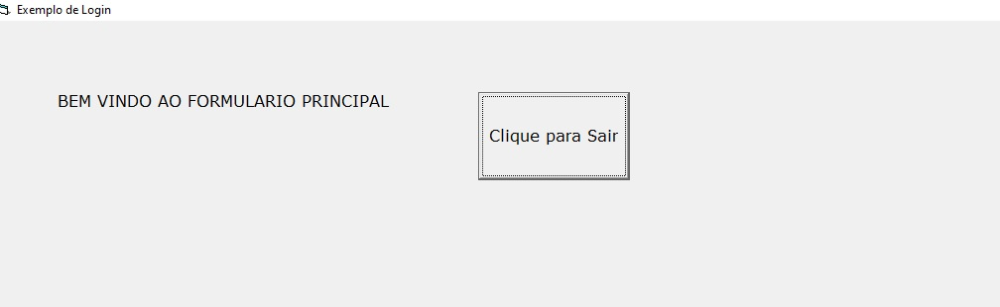

# Pequeno Projeto de Login, para aplicações em Visual Basic 6

## Aparencia do projeto
- 

    
    

 

## Avisos Gerais
- Se quiser testar o funcionamento, baixe o arquivo executável. Login = admin e senha = 123456.   
- Se quiser contribuir, voce deve ter instalado o visual basic 6 na sua máquina.
- Caso não tenha o VB6 instalado, voce pode testar também no VBA. Basta abrir o excel e em seguida clicar (alt + F11) para abrir o VBA. 

## Objetivo
Desenvolvido para entendimento didádico, tem como objetivo levar ao iniciante como iniciar um programa em Visual Basic 6.

